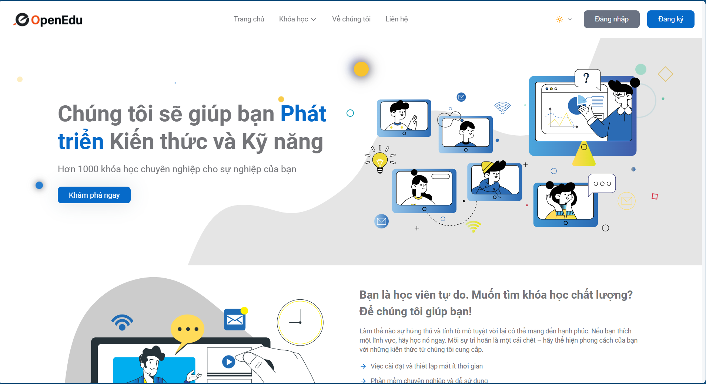
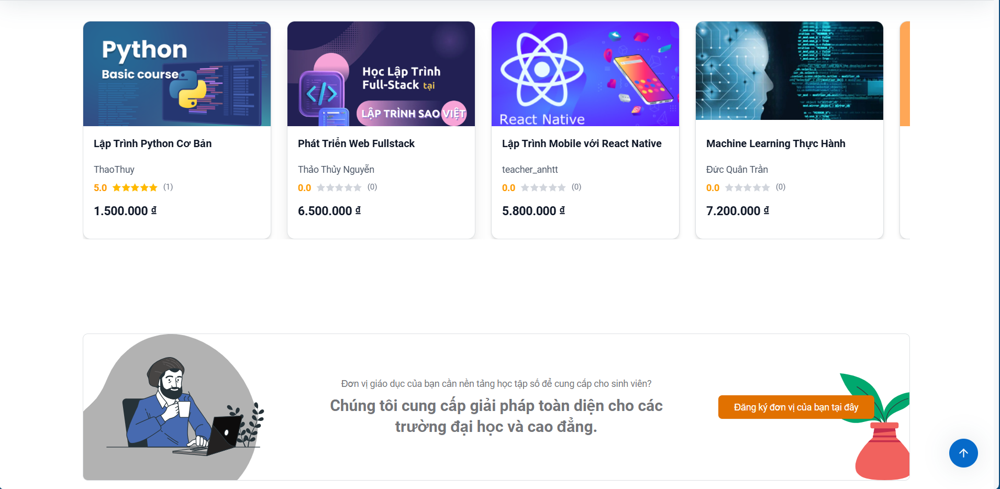
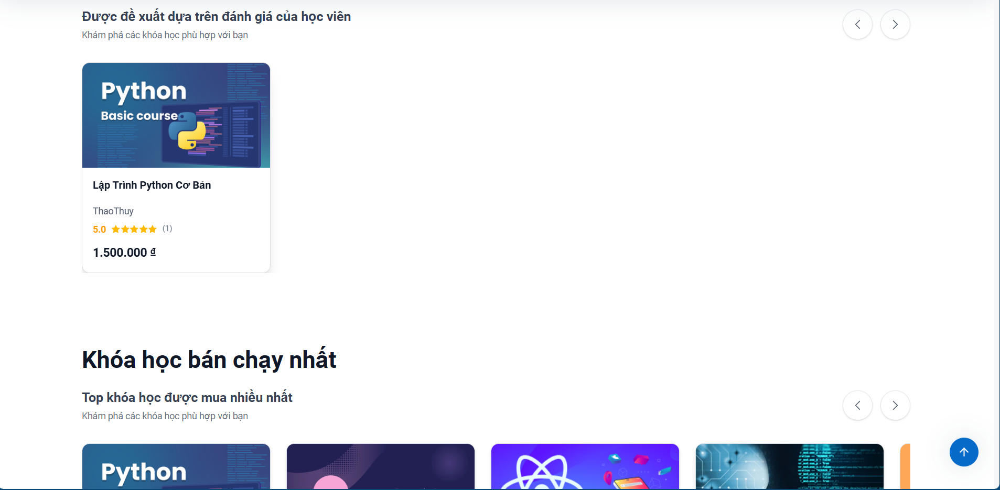
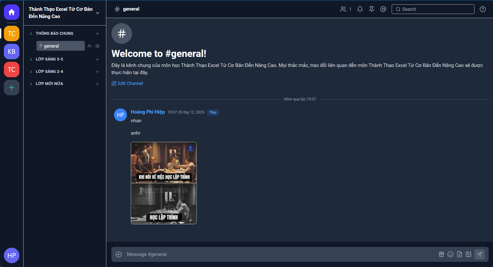

<div align="center">

# OpenEdu

**A full-stack e-learning platform built on event-driven microservices**


</div>

---

OpenEdu is a production-grade e-learning platform supporting multi-role workflows for students, teachers, content experts, and administrators. It features real-time collaborative workspaces, AI-powered study tools, integrated payment processing (VNPay and PayPal), and a fully event-driven backend powered by Apache Kafka.

## Table of Contents

- [Screenshots](#screenshots)
- [Features](#features)
- [Architecture](#architecture)
- [Tech Stack](#tech-stack)
- [Prerequisites](#prerequisites)
- [Getting Started](#getting-started)
- [Environment Variables](#environment-variables)
- [Project Structure](#project-structure)
- [API Overview](#api-overview)
- [Security](#security)
- [Contributing](#contributing)
- [License](#license)

---

## Screenshots

| Student Dashboard | Course Learning |
|---|---|
|  |  |

| Course Management | Real-time Chat |
|---|---|
|  |  |

---

## Features

<details>
<summary><strong>Students</strong></summary>

- Browse, search (Elasticsearch), and enroll in courses with secure payment
- Track learning progress with interactive dashboards and visual analytics
- Attend lessons, take quizzes, and submit assignments
- AI-powered study tools: document parser, flashcard generator, quiz generator
- Real-time chat with classmates and instructors via workspace channels
- Receive certificates upon course completion
- Participate in course discussion forums

</details>

<details>
<summary><strong>Teachers / Instructors</strong></summary>

- Create and manage courses with rich multimedia content (TinyMCE editor)
- Organize content into modules and lessons with structured ordering
- Build quizzes and assignments; grade student submissions
- Monitor student progress and cohort analytics
- Communicate with students through real-time workspace channels

</details>

<details>
<summary><strong>Content Experts</strong></summary>

- Review course submissions for quality assurance
- Provide structured scored feedback on course content
- Manage the course approval lifecycle

</details>

<details>
<summary><strong>Administrators</strong></summary>

- Manage users, roles, and permissions across the platform
- Oversee course lifecycle and enrollment status
- Monitor platform analytics and system health

</details>

**Platform-wide:**

- OAuth2 social login (Google, Facebook)
- Kafka-driven decoupled event bus (`course-events`, `class-events`)
- WebSocket real-time chat (STOMP over SockJS)
- File storage via Cloudinary (images, videos, documents)
- SMTP email notifications
- Dark mode UI

---

## Architecture

```
Browser / React 19 (port 3000)
         │  HTTP + STOMP over SockJS
         ▼
   ┌──────────────────────┐
   │   API Gateway :8888   │  ← JWT validated via identity-service on every request
   └──────────┬───────────┘
              │
    ┌─────────┼─────────────────────────────────────────┐
    ▼         ▼               ▼                          ▼
identity   course-service  chat-service            file-service
 :8080       :8088            :8090                  :8084
(MySQL +   (MySQL +        (MongoDB +              (MongoDB +
 Redis)    Elasticsearch + Kafka consumer +         Cloudinary)
           Kafka prod)     WebSocket/STOMP)

    │                            │
    ▼                            ▼
notification-service        ai-service :8000
     :8092                 (MongoDB · WebFlux)
 (MongoDB +                       │
 Kafka consumer +                 ├── document-parser :8001
   SMTP)                          ├── flashcard-svc   :8002
                                  └── quiz-svc        :8003
```

### Request Flow

```
1. Browser → API Gateway (all traffic enters on port 8888)
2. AuthenticationFilter @ Gateway → POST /auth/introspect → identity-service
3. Valid token → request proxied to the target microservice
4. Microservice → Feign calls to peers (token forwarded or service-token generated)
```

### Kafka Event Bus

| Producer | Topic | Consumer | Action |
|---|---|---|---|
| course-service | `course-events` | chat-service | Create course workspace in MongoDB |
| course-service | `class-events` | chat-service | Create class channels; add participants |
| course-service | `class-events` | notification-service | Send enrollment email notifications |

All events use a `KafkaEvent<T>` envelope with a UUID `eventId` for idempotency. Consumers call `EventIdempotencyService` before and after processing to prevent duplicate execution.

### Service-to-Service Authentication

Three strategies are in use depending on the calling context:

| Strategy | Used by | Mechanism |
|---|---|---|
| **A — Forward token** | chat-service, identity-service, file-service | Forward the `Authorization` header from the active HTTP request |
| **B — Service token** | course-service | Generate a short-lived JWT (`type=service-token`) when no HTTP context is available (scheduled jobs, async tasks) |
| **C — WebSocket ThreadLocal** | chat-service (WebSocket handlers) | Token stored in `ThreadLocal` on STOMP CONNECT; read by Feign interceptors inside WebSocket message handlers |

---

## Tech Stack

### Frontend

| Technology | Version | Role |
|---|---|---|
| React | 19.1.0 | UI framework |
| TypeScript | 5.8.3 | Type safety |
| Vite | 7.0.4 | Build tool (dev server on port 3000) |
| React Router | 7.7.1 | Client-side routing |
| Tailwind CSS | 4.1.11 | Utility-first styling |
| shadcn/ui + Radix UI | — | Accessible, unstyled component primitives |
| Framer Motion | 12.23.12 | UI animations |
| Axios | 1.11.0 | HTTP client with automatic token injection and silent refresh |
| @stomp/stompjs | 7.1.1 | WebSocket STOMP messaging |
| TinyMCE React | 6.3.0 | Rich text editor for course content |
| Recharts | 3.5.0 | Data visualizations and analytics |
| jsPDF + html2canvas | — | PDF certificate and report export |
| ExcelJS / xlsx | — | Spreadsheet import and export |
| jwt-decode | 4.0.0 | Client-side JWT claim parsing |
| date-fns | 4.1.0 | Date formatting utilities |

### Backend

| Technology | Version | Role |
|---|---|---|
| Java | 21 | Language |
| Spring Boot | 3.5.3 | Application framework |
| Spring Cloud | 2025.0.0 | Microservices utilities |
| Spring Cloud Gateway | — | API gateway (WebFlux-based) |
| Spring Security | — | Authentication and authorization |
| Spring Data JPA | — | MySQL ORM |
| Spring Data MongoDB | — | MongoDB integration |
| Spring Kafka | — | Event streaming |
| Spring WebSocket | — | STOMP real-time messaging |
| OpenFeign | — | Declarative inter-service HTTP clients |
| Spring WebFlux | — | Reactive HTTP for ai-service |
| MapStruct | — | DTO ↔ entity mapping |
| Lombok | — | Boilerplate code generation |

### Infrastructure

| Component | Role |
|---|---|
| MySQL 8 | Relational data (identity-service, course-service) |
| MongoDB | Document data (chat-service, file-service, notification-service, ai-service) |
| Redis | Token caching and session storage (identity-service) |
| Elasticsearch + Kibana | Full-text course search and data visualization |
| Apache Kafka + Zookeeper | Async event streaming |
| Cloudinary | Binary file storage (images, videos, documents) |
| Docker + Docker Compose | Container orchestration |

---

## Prerequisites

| Tool | Minimum Version |
|---|---|
| Java JDK | 21 |
| Apache Maven | 3.9+ |
| Node.js | 20+ |
| npm | 10+ |
| Docker | 24+ |
| Docker Compose | 2.x |
| Git | — |

Recommended IDEs: **IntelliJ IDEA** (backend, requires Lombok plugin) · **VS Code** (frontend)

---

## Getting Started

### 1. Clone the repository

```bash
git clone <repository-url>
cd TLCN_E-Learning
```

### 2. Start infrastructure services

From the `spring-microservices` directory, start all required infrastructure with Docker Compose:

```bash
cd spring-microservices
docker-compose -f docker-compose.dev.yml up -d
```

This starts: MySQL, MongoDB, Redis, Elasticsearch, Kibana, Apache Kafka, and Zookeeper.

Verify all containers are healthy:

```bash
docker-compose -f docker-compose.dev.yml ps
```

The MySQL databases (`identity_service`, `course_management`) are initialized automatically from `init-db/01-init.sql`.

### 3. Start backend microservices

Start each service in dependency order (open a separate terminal for each):

```bash
# 1. Identity Service — users, auth, JWT (port 8080)
cd spring-microservices/identity-service && mvn spring-boot:run

# 2. File Service — Cloudinary uploads (port 8084)
cd spring-microservices/file-service && mvn spring-boot:run

# 3. Notification Service — email, in-app alerts (port 8092)
cd spring-microservices/notification-service && mvn spring-boot:run

# 4. Course Service — courses, enrollments, payments (port 8088)
cd spring-microservices/course-service && mvn spring-boot:run

# 5. Chat Service — real-time messaging, workspaces (port 8090)
cd spring-microservices/chat-service && mvn spring-boot:run

# 6. AI Service — document parser, quiz and flashcard generation (port 8000)
cd spring-microservices/ai-service && mvn spring-boot:run

# 7. API Gateway — start last; it proxies all traffic (port 8888)
cd spring-microservices/api-gateway && mvn spring-boot:run
```

Each service reads its configuration from `src/main/resources/application.yml`.

### 4. Start the frontend

```bash
cd react-type-vite
npm install
npm run dev
```

The application is available at **http://localhost:3000**.

---

## Environment Variables

### Frontend — `react-type-vite/.env`

```env
VITE_BASE_URL=http://localhost:8888/api/v1
VITE_WS_URL=http://localhost:8888/api/v1/server/ws
VITE_API_KEY_TINY=<your-tinymce-api-key>
```

### Backend — key values per service

Each service reads from its own `application.yml`. The values below are the most critical to configure for local development.

> **Important:** `jwt.signerKey` must be identical across every service that issues or validates JWTs (`identity-service`, `course-service`, `chat-service`, `api-gateway`).

#### identity-service

```yaml
spring:
  datasource:
    url: jdbc:mysql://localhost:3306/identity_service
    username: root
    password: <password>
  data:
    redis:
      host: localhost
      port: 6379
jwt:
  signerKey: <shared-secret>
  valid-duration: 3600           # access token TTL in seconds
  refreshable-duration: 2592000  # refresh token TTL in seconds
app:
  services:
    file: http://localhost:8084
    course: http://localhost:8088
```

#### course-service

```yaml
spring:
  datasource:
    url: jdbc:mysql://localhost:3306/course_management
    username: root
    password: <password>
  elasticsearch:
    uris: http://localhost:9200
  kafka:
    bootstrap-servers: localhost:9092
jwt:
  signerKey: <shared-secret>     # Must match identity-service
app:
  services:
    identity: http://localhost:8080/identity
    file: http://localhost:8084
    notification: http://localhost:8092
```

#### chat-service

```yaml
spring:
  data:
    mongodb:
      uri: mongodb://localhost:27017/workspace_db
  kafka:
    bootstrap-servers: localhost:9092
    consumer:
      group-id: myGroup
services:
  identity:
    url: http://localhost:8080/identity
  file:
    url: http://localhost:8084
  notification:
    url: http://localhost:8092
```

#### ai-service

```yaml
spring:
  data:
    mongodb:
      uri: mongodb://localhost:27017/ai_service
ai:
  service:
    document-parser: http://localhost:8001/api/v1/parser
    quiz: http://localhost:8003/api/v1/quiz
    flashcard: http://localhost:8002/api/v1/flashcards
```

---

## Project Structure

```
TLCN_E-Learning/
├── react-type-vite/                    # Frontend (React + TypeScript + Vite)
│   ├── src/
│   │   ├── components/                 # UI components, organized by role
│   │   │   ├── admin/
│   │   │   ├── student/
│   │   │   ├── teacher/
│   │   │   ├── expert/
│   │   │   ├── shared/
│   │   │   └── ui/                     # shadcn/ui wrappers and base atoms
│   │   ├── pages/                      # Page-level components by role
│   │   ├── routes/                     # React Router route definitions
│   │   │   ├── MainRoute.tsx           # Root router
│   │   │   ├── AdminRoute.tsx
│   │   │   ├── StudentRoute.tsx
│   │   │   ├── TeacherRoute.tsx
│   │   │   └── protected/              # Auth guard (ProtectedRoute)
│   │   ├── services/
│   │   │   ├── api/                    # Typed API functions, organized by role
│   │   │   │   ├── httpClient/         # axiosInstance (auth) + publicAxiosInstance
│   │   │   │   ├── student/
│   │   │   │   ├── teacher/
│   │   │   │   ├── admin/
│   │   │   │   ├── workspace/
│   │   │   │   ├── authApi.ts
│   │   │   │   ├── aiStudyApi.ts
│   │   │   │   └── notificationApi.ts
│   │   │   └── websocket/              # STOMP WebSocket setup
│   │   ├── hooks/                      # Custom React hooks
│   │   │   ├── useChatWebSocket.ts     # WebSocket + STOMP connection management
│   │   │   └── useWorkspace.ts         # Workspace state management
│   │   ├── context/                    # React Context providers
│   │   │   ├── auth-context/           # Authentication state
│   │   │   └── theme-context/          # Dark / light theme
│   │   ├── types/                      # TypeScript interfaces (mirrors backend DTOs)
│   │   │   ├── chat.types.ts
│   │   │   ├── course.types.ts
│   │   │   └── channel.types.ts
│   │   └── utils/                      # auth.utils.ts, roleUtils.ts
│   ├── package.json
│   └── vite.config.ts
│
└── spring-microservices/               # Backend (Spring Boot 3.5.3)
    ├── api-gateway/                    # API Gateway — port 8888
    ├── identity-service/               # Auth, users, roles — port 8080
    ├── course-service/                 # Courses, enrollments, payments — port 8088
    ├── chat-service/                   # Real-time messaging, workspaces — port 8090
    ├── file-service/                   # File upload and storage — port 8084
    ├── notification-service/           # Email and in-app notifications — port 8092
    ├── ai-service/                     # AI study tools (WebFlux) — port 8000
    ├── docker-compose.yml              # Production container orchestration
    ├── docker-compose.dev.yml          # Development infrastructure only
    ├── build-and-push.sh               # Build and push Docker images
    └── init-db/
        └── 01-init.sql                 # MySQL schema initialization
```

Each Spring Boot service follows a consistent internal package layout:

```
<service>/src/main/java/<root-package>/
├── controller/          # REST endpoints (@RestController)
├── service/             # Business logic interfaces
│   └── impl/            # Service implementations
├── repository/          # Data access (Spring Data JPA or MongoDB)
│   └── httpclient/      # Feign clients for inter-service HTTP calls
├── dto/
│   ├── request/         # Inbound request DTOs
│   └── response/        # Outbound response DTOs
├── model/ or entity/    # Domain models / JPA entities
├── mapper/              # MapStruct DTO ↔ model converters
├── config/              # Spring @Configuration classes
├── exception/           # Custom exceptions + @ControllerAdvice handler
└── kafka/               # Kafka producers and consumers
```

---

## API Overview

All requests enter through the API Gateway at `http://localhost:8888`.

### Gateway Route Table

| Path Prefix | Target Service | Port | Notes |
|---|---|---|---|
| `/api/v1/identity/**` | identity-service | 8080 | |
| `/api/v1/course-management/**` | course-service | 8088 | |
| `/api/v1/server/**` | chat-service (REST) | 8090 | |
| `/api/v1/server/ws/**` | chat-service | 8090 | WebSocket upgrade |
| `/api/v1/chat/forum/**` | chat-service | 8090 | |
| `/api/v1/file-handler/**` | file-service | 8084 | |
| `/api/v1/notifications/**` | notification-service | 8092 | |
| `/api/v1/ai/**` | ai-service | 8000 | |

### Public Paths (No JWT Required)

These paths bypass the `AuthenticationFilter` in the gateway:

```
POST  /api/v1/identity/auth/**                        # Login, logout, refresh, introspect
POST  /api/v1/identity/users/registration             # User registration
GET   /api/v1/course-management/published-courses/**  # Public course listing
GET   /api/v1/course-management/educational-unit/register
WS    /api/v1/server/ws/**                            # WebSocket handshake
GET   /api/v1/chat/forum/**
GET   /api/v1/notifications/subscribe/**              # SSE subscription
```

### Response Envelope

All API responses use a consistent wrapper:

```json
{
  "success": true,
  "data": { ... },
  "error": null
}
```

Error responses set `"success": false`, `"data": null`, and populate `"error"` with a message string.

---

## Security

| Mechanism | Details |
|---|---|
| **JWT authentication** | Short-lived access tokens (1 hour) + long-lived refresh tokens (30 days) signed with a shared HMAC secret |
| **Token introspection** | API Gateway validates every non-public request by calling identity-service's `/auth/introspect` endpoint |
| **Role-based access control** | Roles (`STUDENT`, `TEACHER`, `EXPERT`, `ADMIN`, `SYSTEM_ADMIN`) are encoded in the `scope` JWT claim and enforced at the service layer |
| **Service-to-service auth** | Feign calls either forward the user token (Strategy A) or present a machine-issued service token (Strategy B) |
| **Password hashing** | BCrypt with default strength |
| **OAuth2 social login** | Google and Facebook — identity-service exchanges the authorization code for a user profile and issues a platform JWT |
| **CORS** | Configured at the API Gateway for the frontend origin |
| **Rate limiting** | Applied at the API Gateway |

---

## Contributing

### Branch Naming

```
feature/<short-description>    # New functionality
fix/<short-description>        # Bug fix
chore/<short-description>      # Refactoring, dependency updates, CI changes
hotfix/<short-description>     # Urgent production fix
```

### Commit Convention

Follow [Conventional Commits](https://www.conventionalcommits.org/):

```
feat: add certificate PDF download endpoint
fix: handle null scoreCollection field on startup
chore: update Spring Boot to 3.5.3
docs: document Kafka event schema
```

### Rules for Common Changes

**Adding a new Feign client in chat-service:**  
Use `AuthenticationRequestInterceptor` in `@FeignClient(configuration = ...)`. The token is resolved automatically from `ThreadLocal` (WebSocket context) or the active HTTP request.

**Adding a new Feign client in course-service:**  
Use `FeignClientConfig.class`. A service token is generated automatically via `JwtService.generateServiceToken()` when no HTTP request context is available.

**Adding a new Kafka event:**  
1. Define an event class and wrap it in `KafkaEvent<T>` with a UUID `eventId`.  
2. Publish from the Kafka producer in course-service.  
3. On the consumer side, call `EventIdempotencyService.isProcessed(eventId)` before processing and `markProcessed(eventId)` after.

**Adding a new API Gateway route:**  
Add the route in `api-gateway/src/main/resources/application.yaml`. If the path is public, also add it to the public-path pattern list in `AuthenticationFilter.java`.

**Adding a new frontend API call:**  
Add a typed async function to the appropriate file in `src/services/api/<role>/`. Use `axiosInstance` for authenticated endpoints or `publicAxiosInstance` for public ones. Update `src/types/` to reflect any backend DTO changes.

---

## License

Developed as a capstone thesis project (KLTN) at Ho Chi Minh City University of Technology and Education (HCMUTE).

---

<div align="center">
Built by Hiếu & Hiệp — HCMUTE 2026
</div>
