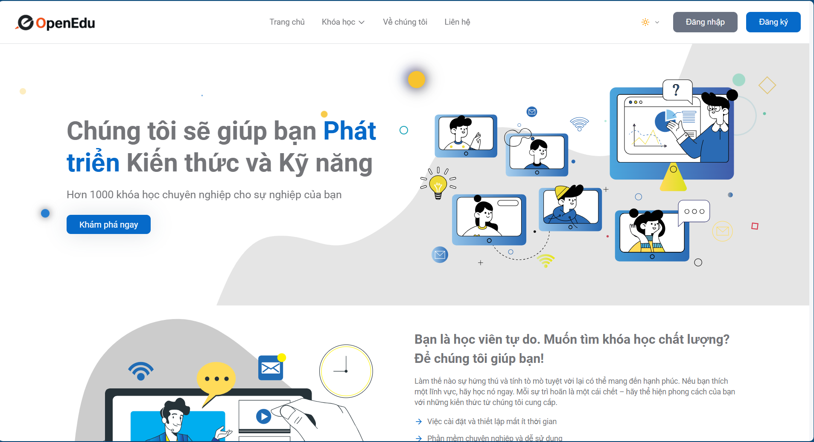
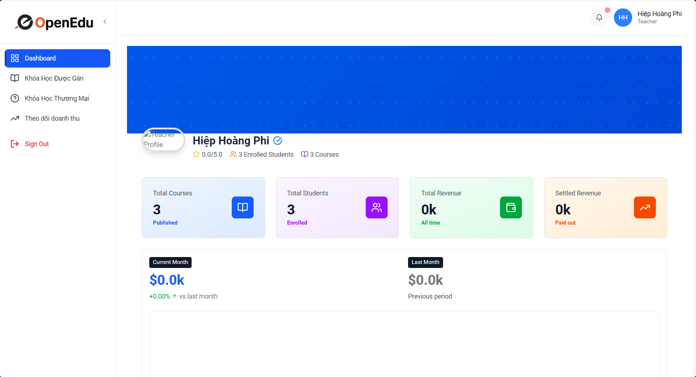
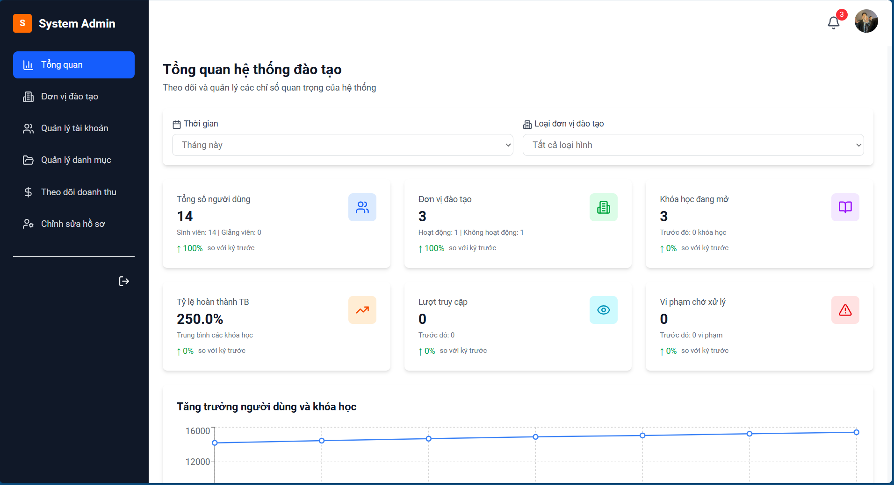
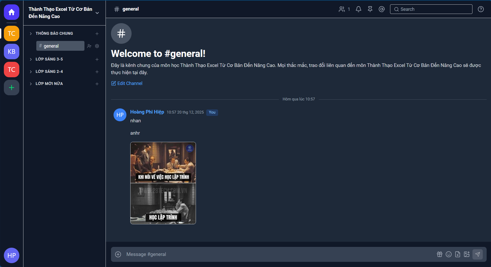

# E-Learning Platform - Frontend

A modern, comprehensive e-learning platform built with React, TypeScript, and Vite. This application serves educational institutions, instructors, and students by providing a complete learning management system (LMS) with course management, real-time chat, interactive content creation, and multi-role access control.

## 🎯 Overview

### What Does This Project Do?

This frontend application provides an intuitive and feature-rich interface for:

- **Course Management**: Create, organize, and deliver educational content
- **Learning Experience**: Interactive course consumption with progress tracking
- **Real-time Communication**: WebSocket-based chat system for collaboration
- **Multi-Role System**: Dedicated dashboards for Students, Teachers, Users, System Admins, and Universities
- **Content Creation**: Rich text editing with TinyMCE integration
- **Payment Integration**: Support for course purchases and revenue management
- **Progress Analytics**: Comprehensive dashboards with charts and statistics

### Who Is This For?

- **System Administrators**: Platform-wide management and oversight
- **Educational Institutions**: Universities and training centers managing online courses
- **Instructors/Teachers**: Content creators delivering courses to students
- **Students**: Learners accessing courses, tracking progress, and engaging with content
- **Users**: People who need to resources for learning, research, or skill development,... They need to buy courses and access learning materials.

### Problems We Solve

✅ **Fragmented Learning Tools**: Unified platform for all e-learning needs  
✅ **Content Management Complexity**: Intuitive course creation and organization  
✅ **Communication Barriers**: Real-time chat and collaboration features  
✅ **Access Control**: Sophisticated role-based permissions  
✅ **Progress Tracking**: Comprehensive analytics for students and instructors  
✅ **Payment Processing**: Integrated payment flows for course monetization

---

## 🚀 Technologies Used

### Core Stack

- **[React 19](https://react.dev/)** - UI library with latest features
- **[TypeScript 5.8](https://www.typescriptlang.org/)** - Type-safe development
- **[Vite 7](https://vite.dev/)** - Lightning-fast build tool and dev server
- **[React Router v7](https://reactrouter.com/)** - Client-side routing

### Styling & UI

- **[Tailwind CSS 4](https://tailwindcss.com/)** - Utility-first CSS framework
- **[shadcn/ui](https://ui.shadcn.com/)** - Accessible component library
- **[Radix UI](https://www.radix-ui.com/)** - Unstyled accessible components
- **[Framer Motion](https://www.framer.com/motion/)** - Animation library
- **[Lucide React](https://lucide.dev/)** - Beautiful icon set
- **[Heroicons](https://heroicons.com/)** - Additional UI icons

### State & Data Management

- **[Axios](https://axios-http.com/)** - HTTP client with interceptors
- **[Immer](https://immerjs.github.io/immer/)** - Immutable state updates
- **[JWT Decode](https://github.com/auth0/jwt-decode)** - Token parsing

### Rich Features

- **[TinyMCE React](https://www.tiny.cloud/docs/tinymce/latest/react-ref/)** - WYSIWYG editor for content creation
- **[WebSocket (STOMP.js)](https://stomp-js.github.io/stomp-websocket/)** - Real-time messaging
- **[Recharts](https://recharts.org/)** - Data visualization
- **[date-fns](https://date-fns.org/)** - Date manipulation utilities
- **[React Hot Toast](https://react-hot-toast.com/)** & **[React Toastify](https://fkhadra.github.io/react-toastify/)** - Notifications

### Development Tools

- **[ESLint](https://eslint.org/)** - Code linting
- **[TypeScript ESLint](https://typescript-eslint.io/)** - TypeScript-specific linting

---

## 📁 Project Structure

```
react-type-vite/
├── public/                      # Static assets
│   └── theme-init.js           # Dark mode initialization
├── src/
│   ├── assets/                 # Images and static files
│   │   ├── images/
│   │   └── payment/
│   ├── components/             # React components organized by role
│   │   ├── admin/              # Admin-specific components
│   │   ├── auth/               # Authentication UI
│   │   ├── shared/             # Reusable components
│   │   ├── student/            # Student-specific components
│   │   ├── system/             # System utilities
│   │   ├── system-admin/       # System admin components
│   │   ├── teacher/            # Teacher/instructor components
│   │   ├── ui/                 # shadcn/ui components
│   │   ├── university/         # University-specific components
│   │   └── user/               # General user components
│   ├── context/                # React Context providers
│   │   ├── auth-context/       # Authentication state
│   │   ├── teacher/            # Teacher-specific state
│   │   └── theme-context/      # Dark/light theme
│   ├── errors/                 # Error handling utilities
│   │   ├── AppError.ts
│   │   ├── errorHandler.ts
│   │   └── typeError.ts
│   ├── hooks/                  # Custom React hooks
│   │   ├── useChatWebSocket.ts # WebSocket chat hook
│   │   ├── useErrorHandler.ts
│   │   ├── usePagination.ts
│   │   ├── useTokenExpiry.ts
│   │   └── useWorkspace.ts
│   ├── lib/                    # Utility libraries
│   │   └── utils.ts            # Helper functions
│   ├── motion/                 # Framer Motion animations
│   │   ├── AnimatedComponents.tsx
│   │   ├── InteractiveComponents.tsx
│   │   └── variants.ts
│   ├── pages/                  # Page components by role
│   │   ├── admin/
│   │   ├── auth/
│   │   ├── shared/
│   │   ├── student/
│   │   ├── system-admin/
│   │   ├── teacher/
│   │   ├── user/
│   │   └── workspace/
│   ├── routes/                 # Route protection and definitions
│   │   ├── AdminRoute.tsx
│   │   ├── StudentRoute.tsx
│   │   ├── TeacherRoute.tsx
│   │   ├── SystemAdminRoute.tsx
│   │   └── protected/
│   ├── services/               # API service layer
│   │   └── api/
│   │       └── httpClient/     # Axios instances
│   ├── styles/                 # Global styles
│   │   ├── admin.css
│   │   ├── authenticate.css
│   │   ├── bootstrap-utilities.css
│   │   ├── hero-animations.css
│   │   ├── theme-overrides.css
│   │   ├── tinymce-content.css
│   │   └── typography.css
│   ├── types/                  # TypeScript type definitions
│   │   ├── account.enum.ts
│   │   ├── channel.types.ts
│   │   ├── chat.types.ts
│   │   ├── course.types.ts
│   │   ├── dashboard.types.ts
│   │   ├── pagination.types.ts
│   │   └── user.types.ts
│   ├── utils/                  # Utility functions
│   │   ├── auth.utils.ts
│   │   ├── autoSaveUtils.ts
│   │   └── roleUtils.ts
│   ├── App.tsx                 # Root application component
│   ├── main.tsx               # Application entry point
│   └── index.css              # Global CSS imports
├── docs/                       # Documentation
│   ├── AUTH_SYSTEM_GUIDE.md
│   ├── DARK_MODE_GUIDE.md
│   ├── WEBSOCKET_CHAT_GUIDE.md
│   └── ...
├── components.json             # shadcn/ui configuration
├── tailwind.config.js          # Tailwind CSS configuration
├── tsconfig.json              # TypeScript configuration
├── vite.config.ts             # Vite configuration
└── package.json               # Dependencies and scripts
```

---

## 🛠️ Installation & Setup

### Prerequisites

- **Node.js** >= 18.x
- **npm** >= 9.x or **yarn** >= 1.22.x

### Installation Steps

1. **Clone the repository**

   ```bash
   git clone <repository-url>
   cd react-type-vite
   ```

2. **Install dependencies**

   ```bash
   npm install
   # or
   yarn install
   ```

3. **Set up environment variables** (see [Environment Variables](#-environment-variables) section)

4. **Run the development server**

   ```bash
   npm run dev
   # or
   yarn dev
   ```

5. **Access the application**
   - Open your browser at [http://localhost:3000](http://localhost:3000)

### Build for Production

```bash
npm run build
# or
yarn build
```

This creates an optimized production build in the `dist/` folder.

### Preview Production Build

```bash
npm run preview
# or
yarn preview
```

---

## 🔐 Environment Variables

Create a `.env` file in the root directory with the following variables:

```env
# Backend API Configuration
VITE_BASE_URL=http://localhost:8888/api/v1

# WebSocket Configuration (for real-time chat)
VITE_WS_URL=http://localhost:8090/server/ws

# TinyMCE Rich Text Editor
VITE_API_KEY_TINY=your_tinymce_api_key_here

# Optional: Additional Configuration
# VITE_APP_NAME=Education 4All
# VITE_APP_VERSION=1.0.0
```

### Environment Variable Details

| Variable            | Description                          | Required | Default                        |
| ------------------- | ------------------------------------ | -------- | ------------------------------ |
| `VITE_BASE_URL`     | Backend REST API base URL            | Yes      | `http://localhost:8888/api/v1` |
| `VITE_WS_URL`       | WebSocket server URL for chat        | Yes      | -                              |
| `VITE_API_KEY_TINY` | TinyMCE API key for rich text editor | Yes      | -                              |

> **Note**: All environment variables must be prefixed with `VITE_` to be accessible in the application via `import.meta.env`.

---

## 🔌 Backend Connection

### REST API

The application connects to a Spring Boot backend via Axios HTTP client. The base URL is configured via `VITE_BASE_URL`.

**Axios Configuration**: [src/services/api/httpClient/axiosInstance.ts](src/services/api/httpClient/axiosInstance.ts)

Features:

- Automatic JWT token injection
- Token refresh mechanism
- Request/response interceptors
- Error handling and logging

## 🎨 Key Features

### 🧑‍🎓 Student Features

- Browse and search courses
- Enroll in courses
- Track learning progress
- Access course materials (videos, documents, quizzes)
- Participate in real-time chat with instructors and peers

### 👨‍🏫 Teacher/Instructor Features

- Create and manage courses
- Organize content into sections and lessons
- Rich text content creation with TinyMCE
- Upload video content
- Monitor student progress
- Revenue tracking and analytics
- Real-time communication with students

### 🏢 Admin Features

- Manage users within their institution
- Course approval and oversight
- Revenue reports and analytics
- Institution-level dashboards

### ⚙️ System Admin Features

- Platform-wide user management
- University/institution management
- System monitoring and analytics
- Global configuration

### 🎨 UI/UX Features

- Dark/Light theme toggle
- Responsive design (mobile, tablet, desktop)
- Smooth animations with Framer Motion
- Accessible components (WCAG compliant)
- Toast notifications for user feedback

---

## 📸 Demo / Screenshots

> - Landing page

> - Student dashboard

> - Teacher dashboard

> - Stutitions dashboard

>- System admin dashboard

> - Chat interface



---

## 🤝 Contributing

We welcome contributions from the community! Here's how you can help:

### How to Contribute

1. **Fork the repository**

   ```bash
   git clone https://github.com/your-username/react-type-vite.git
   cd react-type-vite
   ```

2. **Create a feature branch**

   ```bash
   git checkout -b feature/your-feature-name
   # or for bug fixes
   git checkout -b fix/your-bug-fix
   ```

3. **Make your changes**

   - Write clean, readable code
   - Follow existing code style and conventions
   - Add comments for complex logic
   - Ensure TypeScript types are properly defined

4. **Test your changes**

   ```bash
   npm run dev
   # Manually test affected features
   npm run build  # Ensure build succeeds
   npm run lint   # Check for linting errors
   ```

5. **Commit your changes**

   ```bash
   git add .
   git commit -m "feat: add new feature X"
   # or
   git commit -m "fix: resolve issue with Y"
   ```

   **Commit Message Convention**:

   - `feat:` New feature
   - `fix:` Bug fix
   - `docs:` Documentation changes
   - `style:` Code style changes (formatting, etc.)
   - `refactor:` Code refactoring
   - `test:` Adding or updating tests
   - `chore:` Maintenance tasks

6. **Push to your fork**

   ```bash
   git push origin feature/your-feature-name
   ```

7. **Open a Pull Request**
   - Go to the original repository on GitHub
   - Click "New Pull Request"
   - Select your branch
   - Provide a clear description of your changes
   - Reference any related issues

### Development Workflow

- **Branch Naming**:

  - Features: `feature/description`
  - Bug fixes: `fix/description`
  - Hotfixes: `hotfix/description`
  - Example: `feature/add-course-rating`

- **Code Review**: All PRs require review before merging
- **Testing**: Ensure your changes don't break existing functionality

### Reporting Issues

If you find a bug or have a feature request:

1. **Check existing issues** to avoid duplicates
2. **Create a new issue** with:
   - Clear, descriptive title
   - Detailed description
   - Steps to reproduce (for bugs)
   - Expected vs actual behavior
   - Screenshots (if applicable)
   - Environment details (OS, browser, Node version)

### Need Help?

- Check the [docs/](docs/) folder for detailed guides
- Open a discussion in Issues
- Contact with me directly: hieu01bdvn@gmail.com

---

## 📄 License

This project is private and proprietary. All rights reserved.

---

## 👥 Team

Developed by the E-Learning Platform Team
>- Trần Trung Hiếu - 22110139
>- Hoàng Phi Hiệp - 22110140

---

**Happy Learning! 🎓✨**
