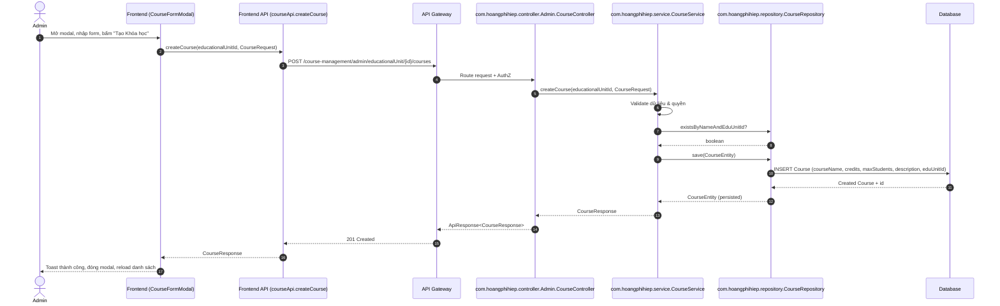
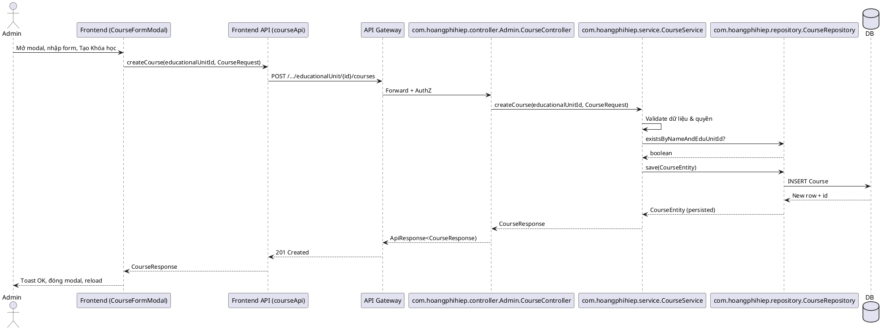

# Sequence: Admin tạo khóa học

Dưới đây là lược đồ sequence ngắn gọn cho luồng tạo khóa học từ frontend đến backend.

## Mermaid

## PlantUML

## Backend nội bộ (Controller → Service → Repository → DB)
- Controller: nhận POST, parse `CourseRequest`, kiểm tra quyền.
- Service: validate nghiệp vụ, kiểm tra trùng tên theo `educationalUnitId`.
- Repository: `save(CourseEntity)` trong transaction.
- DB: ghi bản ghi và trả về khóa chính.

## Lớp và phương thức cụ thể (backend)
- Controller: `com.hoangphihiep.controller.Admin.CourseController`
  - Endpoint: `POST /admin/educationalUnit/{educationalUnitId}/courses`
  - Method: `createCourse(@PathVariable int educationalUnitId, @Valid @RequestBody CourseRequest request)`
- Service: `com.hoangphihiep.service.CourseService`
  - Method: `createCourseForEducationalUnit(int educationalUnitId, CourseRequest request)`
  - Logic: validate quyền, validate dữ liệu, check `existsByCourseNameAndEducationalUnit`, khởi tạo `Course`, `courseRepository.save(course)`, publish `CourseCreatedEvent`, trả `CourseResponse`.
- Repository: `com.hoangphihiep.repository.CourseRepository`
  - Extends: `JpaRepository<Course, Integer>`
  - Methods: `boolean existsByCourseNameAndEducationalUnit(String courseName, int institutionId)`, `Course save(Course entity)`

Ghi chú: đường dẫn thực tế qua API Gateway là `/course-management/admin/educationalUnit/{educationalUnitId}/courses` và được định tuyến về `CourseController` phía course-service.
